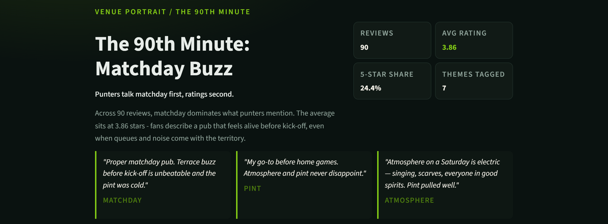
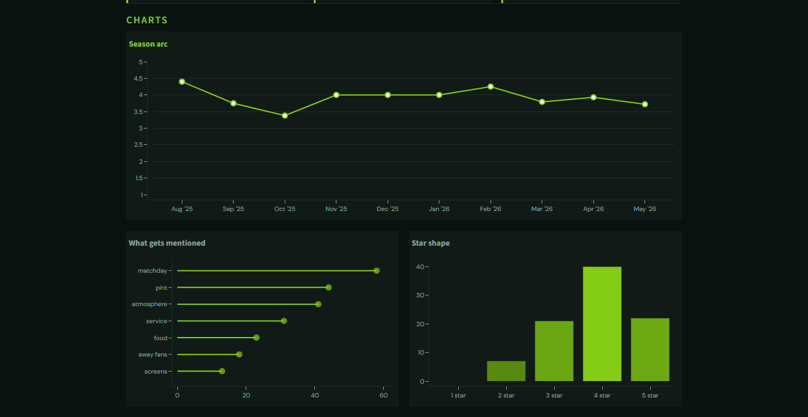
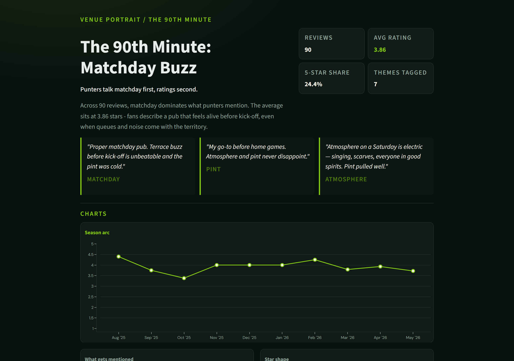

# Venue Portrait

> Editorial review intelligence for pubs, bars, restaurants and hospitality businesses.

**[Live demo](https://venue-portrait-9ytnl8d4uvkcg5sqsbng52.streamlit.app/)** · [Source on GitHub](https://github.com/jmshall93-debug/venue-portrait)

Turn a CSV of customer reviews into an editorial report highlighting what customers actually talk about - not just the average star rating.



---

## Features

- Monthly rating trends
- Representative customer quotes
- Automatic theme tagging from review text
- Rating distribution
- Mention frequency by topic
- Editorial dashboard built with Streamlit

---

## Example Dashboard

### Charts



### Full report walkthrough



---

## Tech Stack

- Python
- Streamlit
- Plotly
- Pandas

---

## Architecture

```text
CSV Reviews
      |
      v
parse.py
      |
      v
Theme Extraction
      |
      v
Narrative Generator
      |
      v
Streamlit Dashboard
```

---

## Running locally

```powershell
git clone https://github.com/jmshall93-debug/venue-portrait.git
cd venue-portrait
py -m venv .venv
.\.venv\Scripts\pip install -r requirements.txt
.\run.bat
```

Opens **http://localhost:8502** in your browser.

---

## Your data

Export reviews as a CSV with **date**, **rating** (1-5), and **review text**. Optional columns: author, source (Google, TripAdvisor). A sample dataset for fictional pub **The 90th Minute** is included in `data/sample_pub_reviews.csv`.